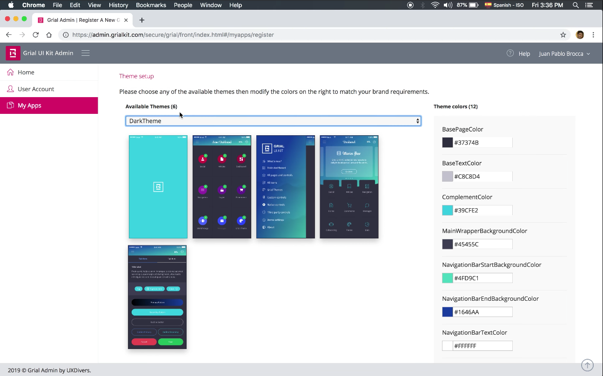
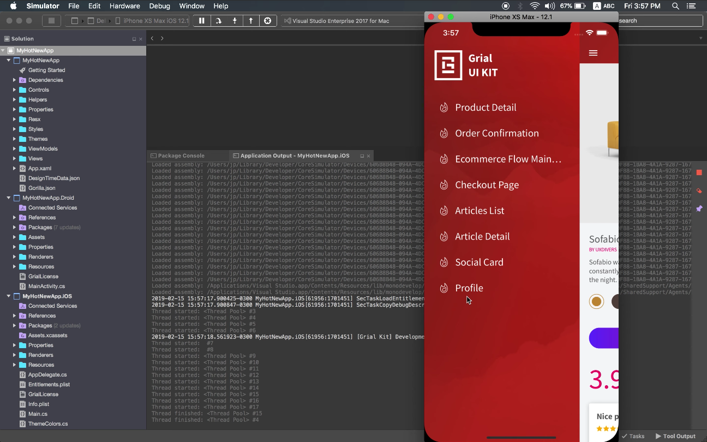
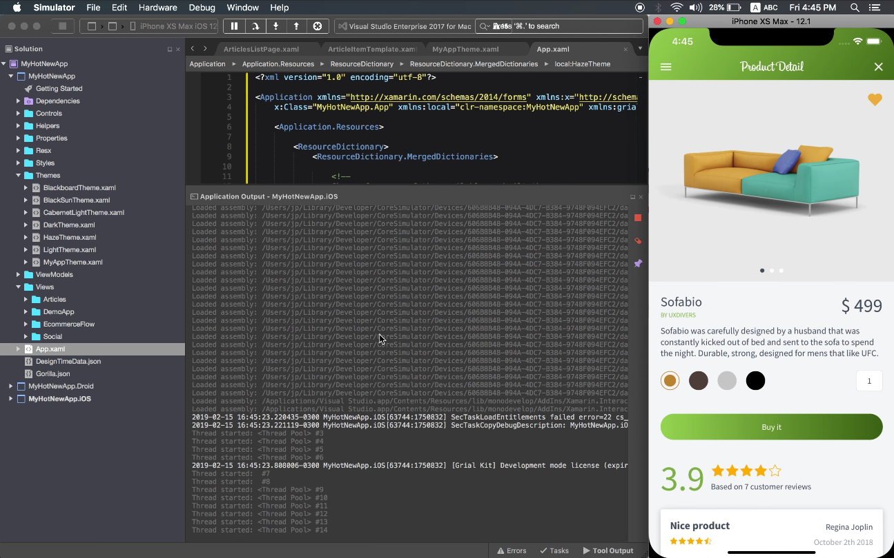
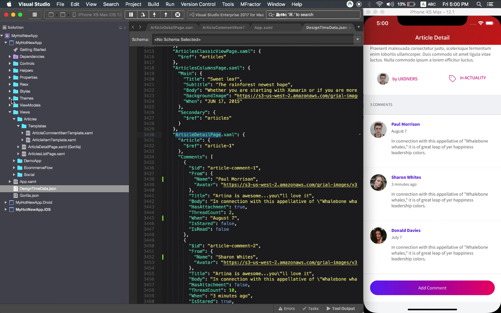

# Grial UI Kit Support

This is our public repository for our customers to get help, report bugs, add feature requests, etc., about 
[Grial UI Kit for Xamarin Forms](http://grialkit.com?ref=git)

## Looking for Grial Docs?
[Check Grial Documentation](//docs.grialkit.com/)

<!--
## Grial 2 Getting Started video series

### [Working with Grial Video Series - Video 1](https://youtu.be/opo0OTAYl0U)

### [Working with Grial Video Series - Video 2](https://youtu.be/E8Tp0EvSyng)

### [Working with Grial Video Series - Video 3](https://youtu.be/7cHmG-eRRs0)

### [Working with Grial Video Series - Video 4](https://youtu.be/SdNDgVUkE3U)

### [Working with Grial Video Series - Video 5](https://youtu.be/qHPnd_7SDFw)

-->

## Grial 3 Getting Started video series

### [Working with Grial 3 Video Series: Grial Admin - Video 1/4](https://youtu.be/MXcTWEZVc8w)

### [Working with Grial 3 Video Series: Solution Overview - Video 2/4](https://youtu.be/pGqiSdDzj9Y)

### [Working with Grial 3 Video Series: Key Concepts - Video 3/4](https://youtu.be/VVffK64C57M)

### [Working with Grial 3 Video Series: Gorilla Player - Video 4/4](https://youtu.be/L3sLf1y2v_c)

<!--
{{!-- "https://i.ytimg.com/vi/opo0OTAYl0U/hqdefault.jpg?sqp=-oaymwEZCNACELwBSFXyq4qpAwsIARUAAIhCGAFwAQ==&rs=AOn4CLDp0OM-JGImfRvTOUdQOMp-khiPWg"  --}}
{{{ youTubeVideo2
"https://youtu.be/MXcTWEZVc8w" 
"g3-video-01.png"
"Working with Grial 3 Video Series: Grial Admin - Video 1/4" 
}}} 
[Working with Grial 3 Video Series: Grial Admin - Video 1/4](https://youtu.be/MXcTWEZVc8w)

{{{ youTubeVideo2
"https://youtu.be/pGqiSdDzj9Y" 
"g3-video-02.png" 
"Working with Grial 3 Video Series: Solution Overview - Video 2/4" 
}}} 
[Working with Grial 3 Video Series: Solution Overview - Video 2/4](https://youtu.be/pGqiSdDzj9Y)

{{{ youTubeVideo2
"https://youtu.be/VVffK64C57M" 
"g3-video-03.png" 
"Working with Grial 3 Video Series 03: Key Concepts - Video 3/4" 
}}} 
[Working with Grial 3 Video Series 03: Key Concepts - Video 3/4](https://youtu.be/VVffK64C57M)

{{{ youTubeVideo2
"https://youtu.be/L3sLf1y2v_c" 
"g3-video-04.png" 
"Working with Grial 3 Video Series: Gorilla Player - Video 4/4" 
}}} 
[Working with Grial 3 Video Series: Gorilla Player - Video 4/4](https://youtu.be/L3sLf1y2v_c)
-->
